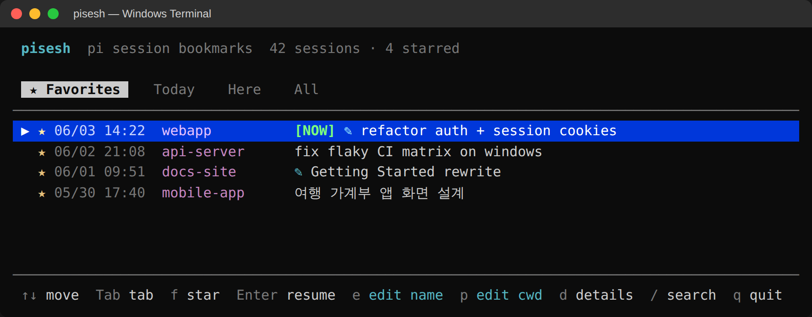
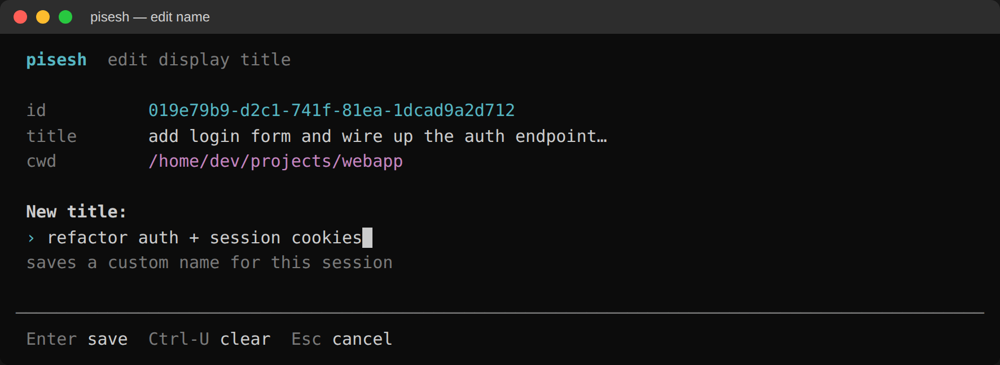
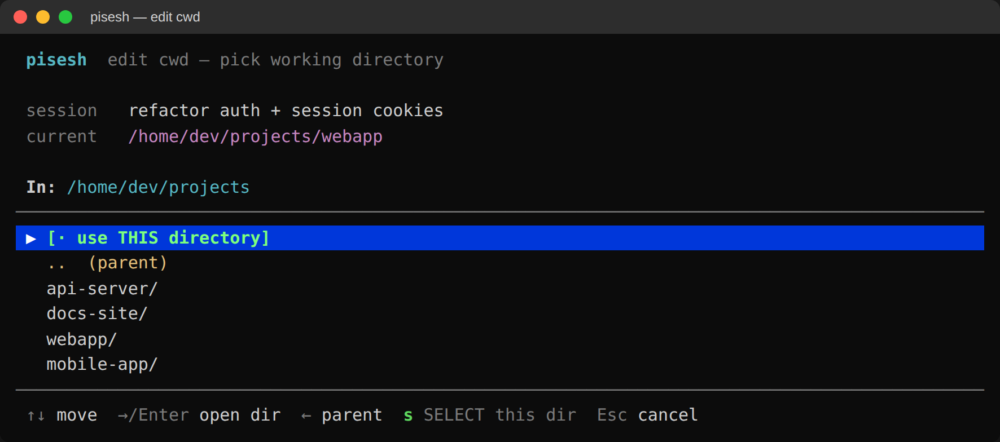

# pisesh

[English](../README.md) | **한국어**

[](https://www.npmjs.com/package/pisesh)
[](https://github.com/Blue-B/pisesh/actions/workflows/ci.yml)
[](../LICENSE)
[](https://nodejs.org/)
[](../package.json)

**[pi coding-agent](https://github.com/earendil-works/pi) 세션을 빠른 키보드 TUI로 즐겨찾기·검색·재개합니다.**

> `pi --resume` 는 시작한 모든 세션을 나열만 합니다. 일주일만 지나도 50개 넘는 항목이 제목도 태그도 순서도 없이 늘어서, 결국 스크롤하며 운에 맡겨야 합니다. pisesh는 바로 그 빠진 것을 채웁니다. ⭐ 즐겨찾기, 즉시 검색, 그리고 지금 붙어있는 세션을 알려주는 `[NOW]` 배지입니다.

## 미리보기

<p align="center">
  
</p>

<p align="center"><sub>실제 캡처: ★ 즐겨찾기 세션이 맨 위, 나머지는 <b>Today</b> / <b>Here</b> / <b>All</b> 탭에. <code>Tab</code> 으로 전환, <code>f</code> 로 별, <code>Enter</code> 로 재개.</sub></p>

## 터미널 화면 둘러보기

TUI가 실제로 어떻게 보이는지 화면별로 보여드립니다. 아래 데이터는 실제 세션이 아니라 지어낸 예시입니다.

**메인 목록.** 하이라이트된 행이 현재 선택이고, `Tab`으로 탭을 순환합니다. 초록 `[NOW]` 배지는 지금 띄운 pi 세션을, 청록 `✎`는 직접 이름을 바꾼 세션을 나타냅니다. 한글 제목도 컬럼 정렬이 유지됩니다:

<p align="center"></p>

**`e` 로 세션 이름 바꾸기.** 첫 prompt는 오래 들여다보는 스레드 제목으로는 별로라서, `e`로 원하는 이름을 지정할 수 있습니다. override로 저장되고(세션 jsonl은 건드리지 않음) 목록에 `✎` 마커가 붙습니다:

<p align="center"></p>

**`p` 로 작업 디렉터리 다시 지정.** 방향키 디렉터리 브라우저로, resume 할 때 pi가 실제로 `cd`할 경로를 고릅니다. 이 경로가 `Here` 탭의 필터 기준이기도 합니다. `s`를 누르면 하이라이트된 디렉터리로 확정됩니다:

<p align="center"></p>

**`Here` 탭**은 pisesh를 띄운 디렉터리와 cwd가 일치하는 세션만 보여줍니다. 프로젝트 안에서 열면 그 프로젝트 스레드만 보이고, 홈 디렉터리의 임시 세션을 스크롤로 지나칠 필요가 없습니다.

## 왜 pisesh?

Pi는 여러 작업 폴더에 걸쳐 세션이 쌓입니다. 홈, 프로젝트 디렉터리들, 임시 작업방 어디에나요. 내장 resume picker는 대충 알파벳순이고 맥락도 기억 못 합니다. 몇 주 지나면:

- "auth 버그 고치던 세션" 이 어느 건지 모름
- 계속 돌아가는 장기 스레드 3~4개를 고정할 방법이 없음
- 잘못된 세션 열어서 무관한 컨텍스트로 오염시킴
- 타임스탬프로 추측하면서 시간 낭비

pisesh는 **단일 파일 Node 스크립트** (의존성 0, ~900 LoC) 입니다. `pi --resume` 이 못하는 모든 걸 채워요.

### 한눈에 보는 가치

| 필요한 것                                    | 제공하는 것                                                       |
| -------------------------------------------- | ----------------------------------------------------------------- |
| 중요한 세션 표시                             | ⭐ 한 키로 별표/해제. 글로벌 JSON 하나에 영구 저장                 |
| 스레드에 진짜 이름 붙이기                     | `e` 로 커스텀 제목 지정(`✎` 표시). 첫-prompt 라벨을 덮어씀          |
| 현재 프로젝트 세션만 보기                     | `Here` 탭이 pisesh를 띄운 디렉터리와 cwd가 같은 세션만 필터    |
| 세션이 재개될 위치 고치기                     | `p` 가 방향키 디렉터리 브라우저를 열어 pi가 `cd`할 cwd 지정       |
| 한 말로 세션 찾기                            | `/` 로 id + 프로젝트 + 첫 user prompt + 커스텀 제목 매치 검색          |
| 지금 붙어있는 세션 파악                      | 라이브 세션에 `[NOW]` 배지 (env var로 pi가 전달)                  |
| 터미널 깔끔히 유지                           | Alt-screen buffer로 종료 시 터미널이 원래 상태 그대로 복원 (vim과 동일) |
| 한·중·일 prompt 읽기                         | 표시 너비 기반 truncation; CJK 들어가도 컬럼 안 흐트러짐           |
| 어디서든 열기                                | 셸 명령어 `pisesh` 또는 pi 안의 `/sesh` 슬래시 명령                 |
| 설치 고통 없음                               | 빌드 단계 없음, native deps 없음, Node 18+ 면 어디서든            |
| 히스토리 안전성                              | pisesh는 작은 JSON 두 개(favorites + overrides)만 씀. 세션 jsonl은 읽기 전용 |

## 설치

### 빠른 설치 (권장)

```bash
# CLI + /sesh 슬래시 명령을 한 번에
pi install npm:pisesh
```

pi 익스텐션으로 등록됩니다. pi 안에서 `/sesh` 치면 끝.

### 셸 CLI만

```bash
npm install -g pisesh
pisesh
```

pi와 별도로 셸 명령으로만 쓰고 싶을 때.

### 소스에서 (개발자)

```bash
git clone https://github.com/Blue-B/pisesh.git
cd pisesh
npm link            # ./bin/pisesh 를 글로벌 PATH로 심볼릭
pisesh --help
```

Pi 익스텐션 쪽: `extensions/sesh.ts` 를 `~/.pi/agent/extensions/` 에 떨궈놓고 pi 안에서 `/reload`.

## 키

| 키                          | 동작                                                          |
| --------------------------- | ------------------------------------------------------------- |
| `↑` `↓` / `j` `k`           | 커서 이동                                                     |
| `Tab` / `h` / `l`           | 탭 전환 (`★ Favorites` → `Today` → `Here` → `All`)             |
| `f` / `Space`               | 선택 세션 별표/해제                                           |
| `Enter`                     | 세션 재개. 세션의(또는 오버라이드한) cwd에서 `pi --session <id>` 실행 |
| `e`                         | 이름 편집. 커스텀 제목을 지정하고 목록에 `✎` 표시          |
| `p`                         | cwd 편집. 방향키 디렉터리 브라우저로 resume / `Here` 기준 경로 지정 |
| `d`                         | 세션 상세 (전체 prompt, 파일 경로, 크기, 시각)                |
| `/`                         | 검색 (id / 프로젝트 / 첫 user prompt / 커스텀 제목)             |
| `Esc`                       | 검색 클리어 → 한 번 더 누르면 종료                            |
| `q` / `Ctrl-C`              | 종료 (터미널 복원됨)                                          |
| `r`                         | 세션 파일 재스캔 (pi가 새 세션 시작했을 때)                   |
| `c` (상세 화면)             | session id 클립보드 복사 (clip.exe / pbcopy / xclip)         |
| `Home` `End` `PgUp` `PgDn`  | 맨위 / 맨아래 / ±10 점프                                     |

## CLI (TUI 아닌) 사용법

스크립트·자동화용:

```bash
pisesh --list                  # 별표된 세션 ID 출력 (줄당 하나)
pisesh --json                  # favorites 파일 전체를 JSON으로
pisesh --star <부분-uuid>      # 스크립트에서 별표 추가
pisesh --unstar <부분-uuid>    # 별표 해제
pisesh --help
```

## 기술 스택

[](https://nodejs.org/) [](https://developer.mozilla.org/docs/Web/JavaScript) [](https://www.typescriptlang.org/) [](https://github.com/earendil-works/pi)

| 영역                | 세부                                                                                            |
| ------------------- | ----------------------------------------------------------------------------------------------- |
| 런타임              | Node.js ≥ 18 (내장 모듈만: `fs`, `path`, `os`, `child_process`, `readline`)                     |
| TUI 렌더링          | Raw ANSI escape (blessed/ink/chalk 등 의존 없음)                                                |
| Alt-screen buffer   | `\x1b[?1049h` / `\x1b[?1049l`, vim·less·htop·droid CLI가 쓰는 것과 같은 원시 기법               |
| 입력                | Node `readline.emitKeypressEvents` raw 모드                                                     |
| 너비 계산           | UAX #11 East Asian Width 범위, ~10줄짜리 인라인 체크로 압축                                     |
| Pi 익스텐션         | `@earendil-works/pi-coding-agent` 익스텐션 API (`ui.custom`, `tui.stop`) 의 TS 팩토리            |
| 저장소              | JSON 파일 2개: `~/.pi/agent/favorites.json` (별표 id) + `~/.pi/agent/pisesh-meta.json` (세션별 제목 / cwd 오버라이드) |
| 세션 탐색           | `~/.pi/agent/sessions/<projectSlug>/*.jsonl` 직접 파일시스템 스캔, 첫 96 KB 만 파싱              |
| 프로세스 모델       | 슬래시 명령이 pi TUI를 멈춤 → stdio 상속으로 pisesh 스폰 → 종료 시 pi 다시 그림                  |

### 명시적으로 **안 쓰는** 것

- 번들 CLI 런타임에 `npm install` 불필요. 의존성이 정말 0개
- native binary / GPU / ffmpeg / DB 없음
- 네트워크 호출, 텔레메트리, 분석 없음
- 데몬 / 백그라운드 프로세스 없음

## 저장 위치

| 무엇       | 어디                                                       |
| ---------- | ---------------------------------------------------------- |
| 즐겨찾기   | `~/.pi/agent/favorites.json`                               |
| 오버라이드 | `~/.pi/agent/pisesh-meta.json` (세션별 커스텀 제목 / cwd, session id로 키잉) |
| 세션       | `~/.pi/agent/sessions/<projectSlug>/<timestamp>_<uuid>.jsonl` (pi 기본 레이아웃. pisesh는 여기 안 씀) |

즐겨찾기 파일 모양:

```json
{
  "ids": [
    "019e79b9-d2c1-741f-81ea-1dcad9a2d712",
    "019e6355-9957-7a30-b4ce-b9db5e3c9ac6"
  ],
  "updated": "2026-05-31T01:33:21.234Z"
}
```

글로벌 단일 파일 (프로젝트별 X). 백업은 파일 하나만 동기화하면 됩니다.

## CJK 너비 처리

한·중·일 / 전각 문자는 터미널에서 **2칸 너비**로 렌더됩니다. pisesh는 truncation·padding 시 JS 코드 유닛 길이가 아니라 표시 너비로 측정합니다. 한글 prompt도 줄넘김 없이, 컬럼 정렬도 그대로 유지됩니다.

```text
✓ webapp          로그인 폼 만들고 인증 엔드포인트 연결…
✓ 가계부앱         이번 달 지출 분석 화면 설계…
✓ docs-site       시작하기 가이드 다시 작성…
```

(이전에는: 한글 prompt가 둘째 줄로 흐르면서 표가 깨졌어요.)

## 요구 사항

- **Node.js ≥ 18** (optional chaining과 `for…of` on strings를 써서 트랜스파일 불필요)
- ANSI escape와 alternate screen buffer를 지원하는 터미널, 즉 사실상 모든 모던 에뮬레이터:
  - Windows: **Windows Terminal**, **WezTerm**, **Alacritty** ✅
  - macOS: **iTerm2**, **Terminal.app**, **WezTerm**, **Alacritty**, **Kitty** ✅
  - Linux: **GNOME Terminal**, **Konsole**, **xterm**, **Alacritty**, **Kitty** ✅
- `Enter` 재개 동작 위해 `$PATH` 상의 [`pi`](https://www.npmjs.com/package/@earendil-works/pi-coding-agent)

## 기여

```bash
git clone https://github.com/Blue-B/pisesh.git
cd pisesh
npm link
npm test        # node --check + smoke test
```

브랜치: 짧은 `feature/<scope>` 또는 `fix/<scope>` → `main`에 squash-merge.
커밋: [Conventional Commits](https://www.conventionalcommits.org/) 형식 (`feat:`, `fix:`, `docs:`, `chore:`).

PR 올려주세요. CI 매트릭스가 Ubuntu, macOS, Windows에서 Node 18, 20, 22로 돌아갑니다.

## 후원

pisesh가 컨텍스트 전환 시간을 아껴주거나 pi 사용 경험을 낫게 만들었다면, 직접 후원이 개발을 가속합니다:

- 후원이 도움이 됩니다: 버그 픽스, 새 키바인딩, 검색 모드 추가, 다른 pi 익스텐션과의 통합.
- 투명성: 데이터 안 팝니다; 자금은 개발 시간 + 커피 한두 잔.
- 일회성 후원자는 README와 릴리스 노트에 크레딧 (옵트아웃 가능).
- 월 후원자 ($3/mo via GitHub Sponsors) 는 "Sponsor Request" 이슈에 best-effort 우선 처리.

[](https://github.com/sponsors/Blue-B) [](https://buymeacoffee.com/beckycode7h) [](https://www.paypal.com/ncp/payment/ZEWFKDX595ESJ)

## 감사

- [pi-coding-agent](https://github.com/earendil-works/pi) by [@mariozechner](https://github.com/mariozechner). `/sesh`를 가능하게 해준 에이전트와 익스텐션 API.
- [interactive-shell 예제 익스텐션](https://github.com/earendil-works/pi/blob/main/packages/coding-agent/examples/extensions/interactive-shell.ts). `ui.custom` + `tui.stop` TTY 인수 패턴을 참고했습니다.
- 즐겨찾기 + 탭 UX 영감: [droid CLI](https://github.com/factory-ai/droid) 와 tmux의 [sesh](https://github.com/joshmedeski/sesh).

## 기여자

pisesh를 더 낫게 만든 모두에게 감사 🙏

<a href="https://github.com/Blue-B"></a>

## Repository activity


## Star History

<a href="https://star-history.com/#Blue-B/pisesh&Date">
  
</a>

## 라이선스

MIT © [Blue-B](https://github.com/Blue-B). [LICENSE](../LICENSE) 참조.

Pi 익스텐션 부분은 `@earendil-works/pi-coding-agent` API를 사용하므로 해당 라이선스는 pi 쪽을 확인하세요. CLI 바이너리는 순수 Node라서 추가 라이선스를 신경 쓸 필요가 없습니다.
